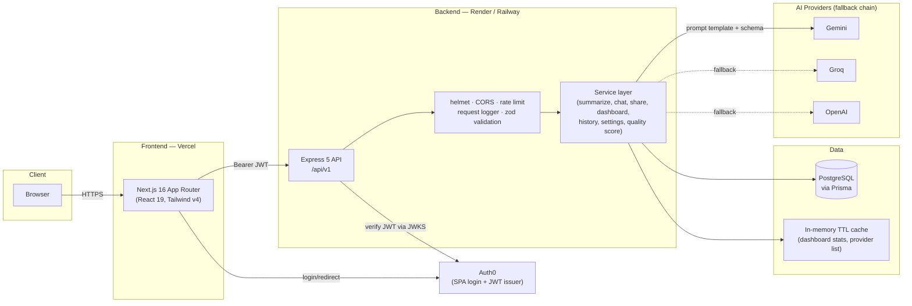

# Architecture

## System diagram



Frontend and backend are independently deployable — they only talk over HTTPS
(`NEXT_PUBLIC_API_BASE` → backend `FRONTEND_ORIGIN` CORS allow-list), so either can be
redeployed or rolled back without touching the other.

## Layered backend

```
routes/       →  controllers/      →  services/         →  prisma / external APIs
(HTTP verbs)     (parse + validate    (business logic,      (Postgres, Gemini/Groq/OpenAI)
                  req, shape res)      no req/res types)
```

Controllers never talk to Prisma directly, and services never see `Request`/`Response` — this
keeps the business logic (e.g. `scoreSummary`, `buildHistoryWhere`, `resolveProviderOrder`)
testable as plain functions with `node:test`, no HTTP mocking required. That's why the test
suite runs in a few seconds with zero live dependencies.

## Key design decisions

**Multi-provider fallback chain, not a single AI SDK.** `summarize.service.ts` tries Gemini →
Groq → OpenAI → a labeled demo response, in an order the user can override via Settings. Any
provider error, empty response, or (since Feature 10) schema-invalid JSON is treated as "try
the next one" — so a single provider outage or quota limit degrades gracefully instead of
failing the request.

**Structured JSON generation, validated, then rendered to display text.** Rather than
redesigning every page's rendering around per-mode JSON shapes, the AI is asked for JSON
(`prompts/schemas.ts` defines a zod schema per mode), validated, and immediately rendered
back into the same plain-text format the UI/PDF export/share pages/chat grounding already
expect (`promptRenderer.ts`). This gets the reliability and hallucination-reduction benefits
of structured output without a frontend rewrite, and keeps `outputText` as the one shape every
downstream feature (chat, share, history, PDF) depends on.

**Prompt versioning as a real rollback mechanism, not just a version number.**
`prompts/templates.ts` keeps the original v1 (free-text) prompts alongside the current v2
(grounded, structured) ones. `ACTIVE_PROMPT_VERSION` is one constant — flipping it is a
one-line, no-migration rollback if a provider's JSON mode ever misbehaves in production.

**Quality scoring is a free heuristic, not an extra LLM call.** `qualityScore.service.ts`
scores groundedness (word-overlap between summary and source) and conciseness deterministically,
with zero added latency or cost per summary. An LLM-as-judge pass would be more accurate but
doubles the cost and latency of every single summarize call — documented as the upgrade path,
not implemented by default, per this project's "prefer free" bias.

**Fire-and-forget persistence on the hot path.** `/summarize` generates and returns the
summary id synchronously (the id is created client-side via `randomUUID()` before the DB
write), but the actual Prisma write happens after the response is sent and never blocks or
fails it. A database hiccup degrades to "summary shown but not saved," not a 500.

**In-memory TTL cache, not Redis.** Dashboard stats and the distinct-provider list are cached
per-user for 60–120 seconds (`utils/cache.ts`). For a single-instance deployment this cuts
repeat-visit DB load with zero infrastructure; the call sites don't change if this is later
swapped for Redis behind the same `getOrSetCache` interface at multi-instance scale.

**API versioning via alias, not a breaking cutover.** `/api/v1` is canonical; `/api` is
mounted on the exact same router as a compatibility alias (`app.ts`) so existing frontend
builds keep working unchanged while new integrations use the versioned path.

## Database schema

```
User
 ├─ id, auth0Sub (unique), email, createdAt
 ├─ preferredProvider, preferredMode, preferredExportFormat
 └─ summaries: Summary[]

Summary
 ├─ id, userId → User, inputText, outputText
 ├─ provider, model, mode
 ├─ inputWordCount, outputWordCount
 ├─ promptVersion, qualityScore, qualityFlags[]
 ├─ createdAt
 ├─ sharedSummary?: SharedSummary        (1:1, cascade delete)
 └─ chatMessages: ChatMessage[]          (1:N, cascade delete)

SharedSummary
 ├─ id, token (unique), summaryId (unique — one active link per summary)
 └─ expiresAt?, createdAt

ChatMessage
 ├─ id, summaryId → Summary, role ("user" | "assistant"), content
 └─ createdAt
```

Indexes: `Summary` has composite indexes on `(userId, createdAt)`, `(userId, mode)`, and
`(userId, provider)` to keep history search/filter/pagination queries index-covered rather
than falling back to a full scan. `ChatMessage` is indexed on `(summaryId, createdAt)` for
ordered conversation retrieval.

See `backend/prisma/migrations/` for the full, incremental migration history.
